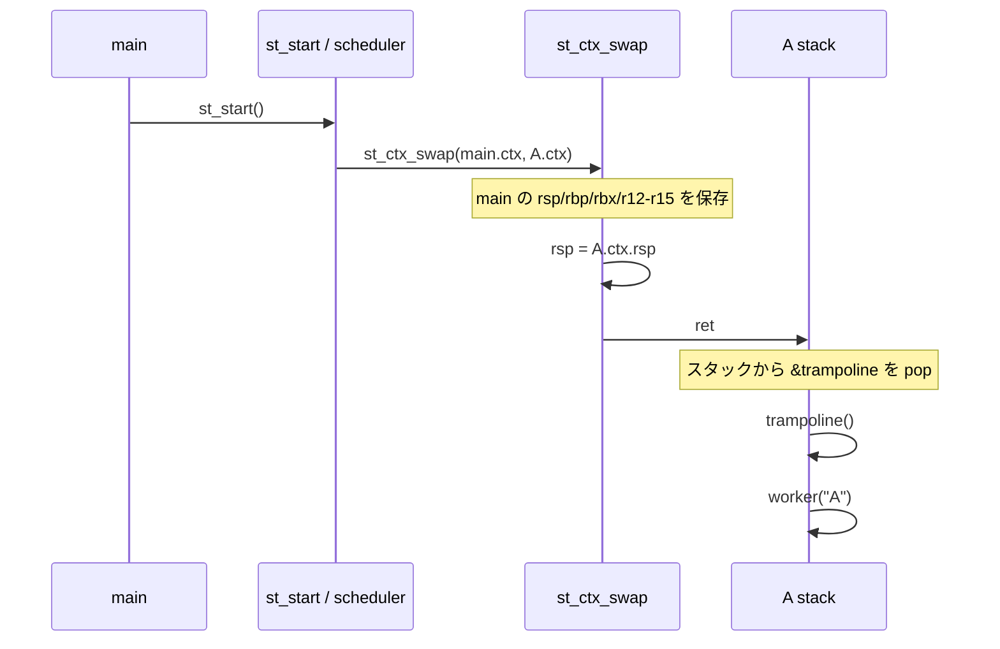
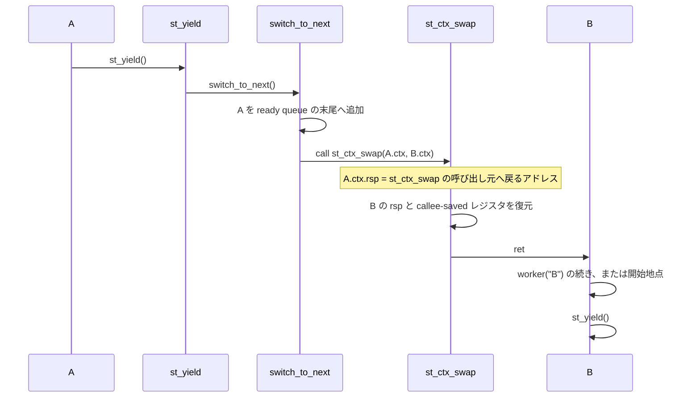

# trampoline

English version: [README_en.md](README_en.md)

x86_64 向けの小さな cooperative threading サンプルです。`trampoline` は、
新しいスレッドへ最初に制御を渡すとき、初期スタックに置いた戻り先へ
`ret` する仕組みを観察するための教材です。

## 前提知識

次の 3 点を前提とします。いずれも本文で必要になったときに改めて説明しますが、
言葉の意味がわからない場合は先に確認してください。

- x86_64 の `call` は「呼び出し元へ戻るアドレス」をスタックへ push し、`ret` は
  それを pop してジャンプする
- スタックはアドレスが高い方向から低い方向へ成長する
- System V AMD64 ABI はレジスタを callee-saved (`rbp`、`rbx`、`r12`〜`r15`) と
  caller-saved (`rax`、`rcx`、`rdx`、`rsi`、`rdi`、`r8`〜`r11` など) に分ける

## 目次

1. [前提知識](#前提知識)
2. [動作](#動作)
3. [API](#api)
4. [コンテキストスイッチ](#コンテキストスイッチ)
5. [ビルドと実行](#ビルドと実行)
6. [gdb で観察する](#gdb-で観察する)

## 動作

`main()` はランタイムを初期化し、A、B、C の 3 スレッドを生成してから
`st_start()` を呼びます。`st_start()` が ready queue の先頭を選び、以後は
各スレッドが次の処理を繰り返します。

```text
表示 -> sleep(1) -> st_yield() -> 次のスレッド
```

スレッドは終了せず、A、B、C が FIFO 順に永遠に切り替わります。最初の
`st_start()` の後に `main()` へ戻る経路はありません。

`sleep(1)` は blocking syscall なので、OS スレッド (プロセス全体) を
ブロックします。A の sleep の間、B と C は一切動けません。協調スレッド
では yield 以外のタイミングで切り替えが起きないため、これが
cooperative threading の本質的な制限です (1 ループに 3 秒かかる理由)。

## API

- `st_init()` — main スレッドを実行中スレッド (current) に設定
- `st_thread_create(fn, arg)` — TCB と専用スタックを作り ready queue へ
- `st_start()` — ready queue の先頭スレッドへ最初の切り替えを行う
- `st_yield()` — 現在のスレッドを queue の末尾へ戻し、次へ切り替え

### TCB (Thread Control Block)

各スレッドは TCB と呼ぶ `struct st_thread` ([`internal.h`](internal.h)) で表します。
OS スレッドは 1 つも作りません。スレッドの実体はこの構造体と専用スタックです。

```c
struct st_thread {
    struct st_ctx ctx;          /* st_ctx_swap の保存先・復元先 (rsp/rbp/rbx/r12-r15) */
    void* stack;                /* 専用スタック (64 KiB) */
    st_fn fn;                   /* スレッドの開始関数 */
    void* arg;                  /* fn へ渡す引数 */
    struct st_thread* next;     /* ready queue の次のリンク */
};
```

以降の説明で「A のコンテキスト」は A の TCB の `ctx` フィールドを指します。

## コンテキストスイッチ

[`ctx.S`](ctx.S) の `st_ctx_swap` が切り替えの本体です。x86_64 の callee-saved
レジスタと `rsp` を保存・復元し、最後に `ret` します。

```text
prev->ctx に rsp/rbp/rbx/r12-r15 を保存
next->ctx から同じレジスタを復元
rsp を next のスタックへ差し替え
ret で next の戻り先へ移動
```

### trampoline とは何か

trampoline はスケジューラではありません。**低レベルの context switch から、
通常の C 関数へ制御を渡すための短い入口関数**です。新しいスレッドを開始するとき、
まだどの関数からも `call` されていないため、通常の関数のような戻りアドレスは
スタックにありません。そこで、最初の context switch だけ次の特別な経路を使います。

```text
1. st_thread_create() が初期スタックに trampoline のアドレスを置く
2. st_start() が switch_to_next() 経由で st_ctx_swap() を呼び、rsp を新しいスタックへ切り替える
3. st_ctx_swap() の ret が trampoline へジャンプする
4. trampoline が current の fn(arg) を通常の call で呼ぶ
5. fn が yield すると、以後は通常の context switch として動く
```

つまり trampoline は、**人工的に用意した最初の `ret` の行き先**と、
**通常の `fn(arg)` の呼出し**の間をつなぐアダプターです。`fn` の引数をどこから
取得するか、`fn` が戻ったらどう終了するかも、この入口に集約しています。

### 1. trampoline 用の初期スタック

`st_thread_create()` は OS にスレッド作成を依頼しません。ヒープ上に TCB と
64 KiB のスタックを確保し、スタックの一番上に次の2ワードを手で作ります。

```c
sp = align_down(stack + 64 * 1024, 16);
*--sp = 0;                    // ABI 用の padding。trampoline が return すれば無効な戻り先
*--sp = (uint64_t)trampoline; // 最初の ret の行き先
thread->ctx.rsp = (uint64_t)sp;
```

スタックはアドレスが高い方向から低い方向へ成長します。したがって初期状態は
次のようになります。

```text
高いアドレス
┌────────────────────────────┐  stack + 64 KiB を 16 バイト境界に丸めた位置
│ 0                          │  ← ABI 用 padding（通常経路では使わない）
├────────────────────────────┤
│ &trampoline                │  ← thread->ctx.rsp が指す位置
└────────────────────────────┘
低いアドレス
```

`ctx.rsp` は `&trampoline` を指します。通常の `call trampoline` は使いません。
次のコンテキストを復元した `st_ctx_swap` が、その位置から `ret` することで
`&trampoline` を取り出し、直接 trampoline へジャンプします。

`0` は trampoline の通常の戻り先ではありません。`ret` が `&trampoline` を pop
した直後、`rsp` はこの `0` を指します。これにより trampoline 関数の入口で
`rsp % 16 == 8` となり、System V AMD64 ABI のアライメントを満たします。
trampoline は `fn` の復帰後に `_exit(0)` を呼ぶため、正常な実行ではこの `0` を
使いません。もし trampoline が誤って return すれば、`ret` がアドレス 0 へ飛ぼうと
して異常終了します。

### 2. 最初のコンテキストスイッチ

`main()` が `st_start()` を呼ぶと、その内部の `switch_to_next()` が ready queue の
先頭 (A) を選び、現在の main のコンテキストを保存して A のコンテキストを復元します。



この最初の `ret` は、通常の関数から戻るための `ret` ではありません。A の
スタックにあらかじめ置いた `&trampoline` を戻りアドレスとして利用しています。
これが trampoline の要点です。

trampoline は引数を受け取りません。`st_ctx_swap` の `ret` は call 命令なしで
飛び込み、引数レジスタを準備しません。この実装では `rdi` などの caller-saved
レジスタに fn や arg を保存していないため、trampoline は引数から TCB を得られ
ません。その代わり、切替えの直前にスケジューラが `current` グローバルを次の
スレッドに設定済みなので、trampoline は `current->fn(current->arg)` と、この
グローバルから自分自身を知ります。別の実装なら、初期コンテキストに `rdi` を
設定して trampoline へ引数を渡すこともできます。

### 3. yield 中の戻りアドレス

A の worker が `st_yield()` を呼ぶと、通常の C 関数呼び出しの連鎖として
`st_yield()` → `switch_to_next()` → `st_ctx_swap()` と進みます。CPU の
`call` 命令は呼び出すたびに「呼び出し元へ戻るアドレス」をスタックへ push
するため、A のスタックには各呼び出しの戻りアドレスが積まれた状態です。

次は**戻りアドレスだけを抜き出した模式図**です。実際のスタックには、各関数の
saved `rbp`、ローカル変数、アラインメント用の領域も混在します。

```text
 A のスタック（yield 中の戻りアドレスだけを表示）
 高いアドレス
 ┌──────────────────────────────────────────
 │ worker へ戻るアドレス (st_yield への call)
 ├──────────────────────────────────────────
 │ st_yield へ戻るアドレス (switch_to_next への call)
 ├──────────────────────────────────────────
 │ switch_to_next へ戻るアドレス (st_ctx_swap への call) ← 現在の rsp
 └──────────────────────────────────────────
 低いアドレス
```

`st_ctx_swap` の最初の命令は、この `rsp` を A の `ctx.rsp` に保存します。
その後 B の `ctx.rsp` を復元して `ret` するため、B は B のスタック上に保存された
戻りアドレスから実行を再開します。



B、C が yield した後に A が再び選ばれると、A の `rsp` と保存済みレジスタが
復元されます。`ret` は A が以前 `st_ctx_swap` を呼んだ直後のアドレスへ戻るため、
そこから `switch_to_next()` と `st_yield()` の残りが順に return し、worker の
次の命令から処理が続きます。復帰は複数の `ret` を辿るいつも通りの関数返りで、
特別な仕組みは何もありません。

上の図は論理的な呼び出し連鎖を表します。物理的なスタックフレームの数と
戻りアドレスの個数は、コンパイラ、バージョン、最適化オプションで変わります。
たとえば `-O2` では `ready_push()` / `ready_pop()` がインライン化され、
`st_yield()` / `switch_to_next()` の一部または全部が末尾呼び出し (`jmp`) に
置き換わることがあります。その場合、スタックには worker が `st_yield()` を
呼んだときの戻りアドレスだけが残り、`st_ctx_swap` の `ret` は worker へ直接
戻ります。これは図と違う**物理的な**スタックですが、正しい動作です。

理由は、最適化後も `st_ctx_swap` が System V AMD64 ABI の関数呼び出し境界として
扱われるからです。切替え時に保存する側の `rsp` は、有効な継続先アドレスを指します。
再開時にはその `rsp` と callee-saved レジスタを復元し、`ret` で継続先へ戻ります。
caller-saved レジスタは、通常の関数呼び出しと同様に値を期待しません。したがって、
インライン化や末尾呼び出しでフレーム構造が変わっても、`st_ctx_swap` がこの ABI 契約を
守る限り context switch は正しく動きます。

ただしこれは「どんな最適化でも無条件に安全」という意味ではありません。切替え関数を
通常の関数呼び出しとして呼び、再開先が有効であり、対象 ABI が要求する保存状態を
すべて復元することが前提です。このサンプルでは x86_64 System V ABI を対象に、
その最小条件を満たしています。

本教材のビルド (`Makefile` の `CFLAGS`) は `-O0` に
`-fno-omit-frame-pointer` と `-fno-optimize-sibling-calls` を組み合わせ、
図に示した**戻りアドレスの連鎖**を実バイナリでも観察しやすくしています。
saved `rbp`、ローカル変数、パディングを含む完全な物理レイアウトまで図と同一に
なるわけではありません。gdb でスタックを追う際もこの設定が前提です。

### 4. 保存するレジスタ

`st_ctx_swap` が保存するのは `rsp`、`rbp`、`rbx`、`r12`〜`r15` だけです。
`rbp`、`rbx`、`r12`〜`r15` は System V AMD64 ABI の callee-saved です。`rsp` は
分類上 callee-saved ではありませんが、関数呼び出しをまたいで論理的に復元される
ため、一緒に保存します。`st_ctx_swap` は通常の関数呼び出し境界で呼ばれるため、
caller-saved レジスタは C コンパイラ側の責任であり、この小さな切り替え処理では
保存しません。

```text
prev->ctx に保存: rsp, rbp, rbx, r12, r13, r14, r15
next->ctx から復元: 同じ7個
最後に: rsp を差し替えた状態で ret
```

カーネルのスケジューラ、タイマ割り込み、`setcontext()`、`makecontext()` は
使っていません。単一の OS スレッド上で、ユーザー空間のスタックとレジスタを
手動で差し替えています。

## ビルドと実行

```sh
make build
make run
```

教材では呼出し連鎖とスタックを観察しやすくするため、`-O0`、frame pointer の
保持、末尾呼出し最適化の無効化を指定しています。最適化を有効にすると、関数の
インライン化や末尾呼出しにより「yield 中の戻りアドレス」の図と実際のフレーム数が
一致しないことがあります。

`make run` は無限に動作します。停止するには `Ctrl-C` を使います。
実行すると、A、B、C が 1 秒間隔で FIFO 順に切り替わります
(各スレッドの `sleep(1)` が直列に効くため、1 ループ 3 秒)。

```text
[A] step 0
[B] step 0
[C] step 0
[A] step 1
[B] step 1
[C] step 1
...
```

worker の表示は `snprintf` で組み立てた後、[`safe_helpers.h`](safe_helpers.h) の
`safe_write_str()` が `write(2)` を直接呼びます。`printf` 系の stdio バッファリングは
プロセス全体の状態を持つため、スレッドごとのスタックを手動で切り替えるこの教材では
観察対象外の仕組みを増やさないよう、バッファなしの即時書き出しにしています。

実行経路はホスト環境に応じて自動選択されます。

- x86_64 Linux: native compiler / native execution
- ARM Linux: `x86_64-linux-gnu-gcc` と `qemu-x86_64-static`
- macOS: OrbStack の amd64 Linux VM `x64-linux-env`

macOS で OrbStack の VM を新規作成する場合:

```sh
make linux-machines
make run
```

`ctx.S` は GNU assembler の Intel 構文を使用します。macOS ホスト上で直接
アセンブルするのではなく、x86_64 Linux 経路でビルドしてください。

## gdb で観察する

`-O0` + `-fno-omit-frame-pointer` + `-fno-optimize-sibling-calls` は、この観察の
ための設定です。このサンプルは x86_64 Linux バイナリなので、gdb も x86_64 Linux
環境で実行してください。macOS では OrbStack の VM を使います。VM に gdb がない
場合は、先に `scripts/in-linux.sh x64-linux-env "apt-get update && apt-get install -y gdb"`
を実行します。

```sh
make build
scripts/in-linux.sh x64-linux-env "gdb -q ./trampoline_sample"
```

### 最初の trampoline 到着

```text
(gdb) break trampoline
(gdb) run
(gdb) p/x $rsp
(gdb) x/gx $rsp
(gdb) bt
```

`ret` が `&trampoline` を pop した直後に止まるので、次のことが確認できます。

- `p/x $rsp` のアドレス下位 1 桁が `8` — 関数入口の ABI アライメント
  (`rsp % 16 == 8`)
- `x/gx $rsp` の値が `0x0` — 初期スタックに置いた alignment word。
  `&trampoline` は現在の `rsp` より 8 バイト下 (ret が消費した位置) にありました
- `bt` は通常の caller 連鎖を示しません。GDB のバージョンによって trampoline
  だけを示すか、途中でバックトレースが途切れます。trampoline はどの関数からも
  `call` されていないためです

`break trampoline` でシンボルが解決しない場合は `break st.c:trampoline` を
使ってください。

### yield 中の戻りアドレス

```text
(gdb) break st_ctx_swap
(gdb) run
(gdb) continue
(gdb) bt
(gdb) x/gx $rsp
(gdb) info symbol *(void**)$rsp
```

`run` で最初に止まるのは main から A へ移る最初の切替えです。この時点では
`st_start()` の呼出し連鎖にいます。1 回 `continue` すると、A が yield して B へ
切り替える通常の `call` 連鎖の末尾で止まります。

- `bt` に `st_ctx_swap` ← `switch_to_next` ← `st_yield` ← `worker` の連鎖が
  見えます。「3. yield 中の戻りアドレス」の図に対応します
- `x/gx $rsp` が「`st_ctx_swap` の呼び出し元へ戻るアドレス」です。
  `info symbol` で `switch_to_next` 内のアドレスであることを確認できます

観察後は `Ctrl-C` でプログラムを止め、`quit` で gdb を終了します。
