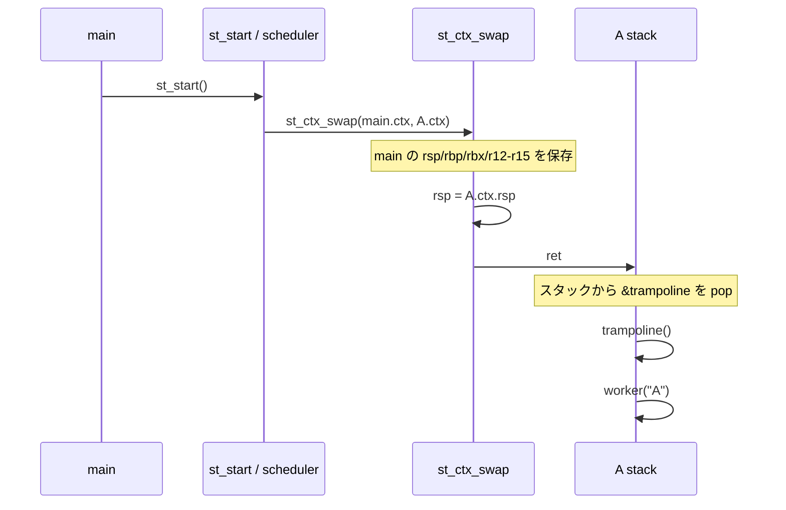
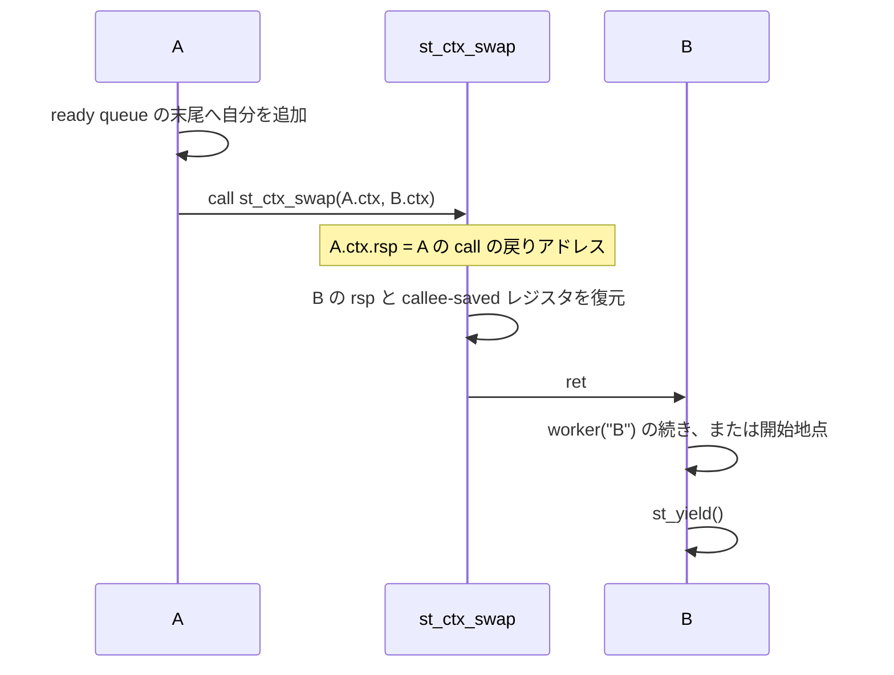

# trampolin

x86_64 向けの小さな cooperative threading サンプルです。`trampolin` は、
新しいスレッドへ最初に制御を渡すとき、初期スタックに置いた戻り先へ
`ret` する仕組みを観察するための教材です。

## 動作

`main()` はランタイムを初期化し、A、B、C の 3 スレッドを生成してから
`st_start()` を呼びます。`st_start()` が ready queue の先頭を選び、以後は
各スレッドが次の処理を繰り返します。

```text
表示 -> sleep(1) -> st_yield() -> 次のスレッド
```

スレッドは終了せず、A、B、C が FIFO 順に永遠に切り替わります。最初の
`st_start()` の後に `main()` へ戻る経路はありません。

## API

- `st_init()` — main のコンテキストを初期化
- `st_thread_start(fn, arg)` — TCB と専用スタックを作成するだけ
- `st_start()` — 生成済みスレッドを ready queue に投入して実行開始
- `st_yield()` — 現在のスレッドを queue の末尾へ戻し、次へ切り替え

## コンテキストスイッチ

[`ctx.S`](ctx.S) の `st_ctx_swap` が切り替えの本体です。x86_64 の callee-saved
レジスタと `rsp` を保存・復元し、最後に `ret` します。

```text
prev->ctx に rsp/rbp/rbx/r12-r15 を保存
next->ctx から同じレジスタを復元
rsp を next のスタックへ差し替え
ret で next の戻り先へ移動
```

新規スレッドでは、スタック上に `trampoline` のアドレスを初期配置します。
そのため最初の切り替えでも trampoline が起動し、そこから `fn(arg)` が
呼ばれます。

### 1. trampoline 用の初期スタック

`st_thread_start()` は OS にスレッド作成を依頼しません。ヒープ上に TCB と
64 KiB のスタックを確保し、スタックの一番上に次の2ワードを手で作ります。

```c
sp = align_down(stack + 64 * 1024, 16);
*--sp = 0;                    // trampoline が戻った場合の番兵
*--sp = (uint64_t)trampoline; // 最初の ret の行き先
thread->ctx.rsp = (uint64_t)sp;
```

スタックはアドレスが高い方向から低い方向へ成長します。したがって初期状態は
次のようになります。

```text
高いアドレス
┌────────────────────────────┐  stack + 64 KiB を16バイト境界に丸めた位置
│ 0                          │  ← trampoline の戻り先用の番兵
├────────────────────────────┤
│ &trampoline                │  ← thread->ctx.rsp が指す位置
└────────────────────────────┘
低いアドレス
```

`ctx.rsp` は `&trampoline` を指します。通常の `call trampoline` は使いません。
次のコンテキストを復元した `st_ctx_swap` が、その位置から `ret` することで
`&trampoline` を取り出し、直接 trampoline へジャンプします。

### 2. 最初のコンテキストスイッチ

`main()` が `st_start()` を呼ぶと、生成待ちリストの A、B、C を FIFO ready queue
へ移します。A を選ぶと、現在の main のコンテキストを保存して A のコンテキストを
復元します。



この最初の `ret` は、通常の関数から戻るための `ret` ではありません。A の
スタックにあらかじめ置いた `&trampoline` を戻りアドレスとして利用しています。
これが trampolin の要点です。

### 3. yield 中の戻りアドレス

A の worker が `st_yield()` を呼ぶと、通常の C 関数呼び出しとして
`st_ctx_swap()` が実行されます。CPU の `call` 命令は、次に実行すべき
「`st_ctx_swap` の呼び出し元へ戻るアドレス」を現在のスタックへ push します。

```text
 A のスタック（yield 中）
 高いアドレス
 ┌────────────────────────────┐
 │ st_yield() の呼び出し元へ戻るアドレス │ ← call が積んだ値
 └────────────────────────────┘  ← 現在の rsp
 低いアドレス
```

`st_ctx_swap` の最初の命令は、この `rsp` を A の `ctx.rsp` に保存します。
その後 B の `ctx.rsp` を復元して `ret` するため、B は B のスタック上に保存された
戻りアドレスから実行を再開します。



B、C が yield した後に A が再び選ばれると、A の `rsp` と保存済みレジスタが
復元されます。`ret` は A が以前 `st_ctx_swap` を呼んだ直後のアドレスへ戻るため、
A の `st_yield()` が終了し、worker の次の命令から処理が続きます。

### 4. 保存するレジスタ

`st_ctx_swap` が保存するのは `rsp`、`rbp`、`rbx`、`r12`〜`r15` だけです。
System V AMD64 ABI ではこれらが callee-saved だからです。`st_ctx_swap` は通常の
関数呼び出し境界で呼ばれるため、caller-saved レジスタは C コンパイラ側の責任で
あり、この小さな切り替え処理では保存しません。

```text
prev->ctx に保存: rsp, rbp, rbx, r12, r13, r14, r15
next->ctx から復元: 同じ7個
最後に: rsp を差し替えた状態で ret
```

カーネルのスケジューラ、タイマ割り込み、`setcontext()`、`makecontext()` は
使っていません。単一の OS スレッド上で、ユーザー空間のスタックとレジスタを
手動で差し替えています。

## ビルドと実行

```sh
make build
make run
```

`make run` は無限に動作します。停止するには `Ctrl-C` を使います。

実行経路はホスト環境に応じて自動選択されます。

- x86_64 Linux: native compiler / native execution
- ARM Linux: `x86_64-linux-gnu-gcc` と `qemu-x86_64-static`
- macOS: OrbStack の amd64 Linux VM `x64-linux-env`

macOS で OrbStack の VM を新規作成する場合:

```sh
make linux-machines
make run
```

`ctx.S` は GNU assembler の Intel 構文を使用します。macOS ホスト上で直接
アセンブルするのではなく、x86_64 Linux 経路でビルドしてください。
