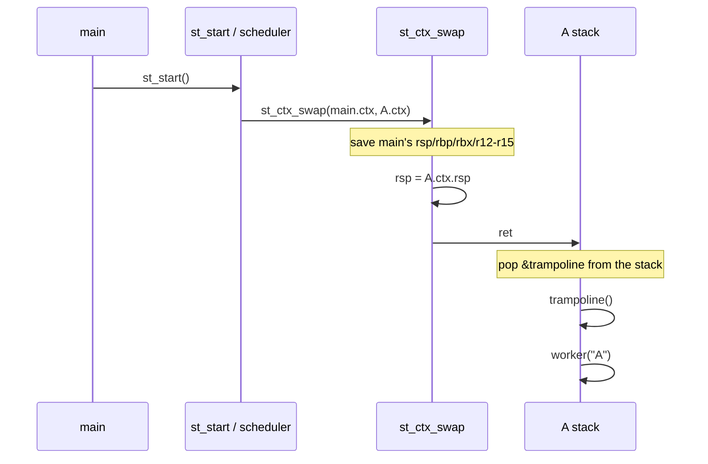
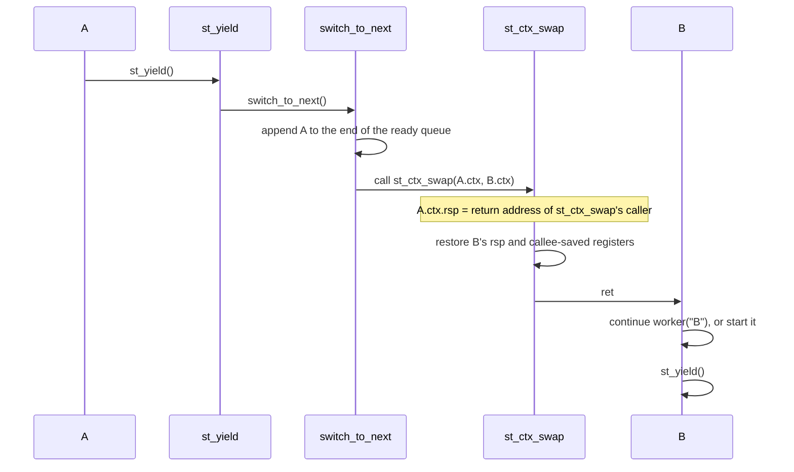

# trampolin

A small cooperative-threading sample for x86_64. `trampolin` is a teaching example
for observing how control first enters a new thread by executing `ret` to an address
placed on its initial stack.

## Behavior

`main()` initializes the runtime, creates three threads (A, B, and C), and calls
`st_start()`. `st_start()` selects the first thread in the ready queue. Each thread
then repeats the following sequence:

```text
print -> sleep(1) -> st_yield() -> next thread
```

The threads never terminate. A, B, and C switch forever in FIFO order. There is no
path back to `main()` after the first call to `st_start()`.

`sleep(1)` is a blocking system call, so it blocks the OS thread (and therefore the
whole process). B and C cannot run while A is sleeping. Because cooperative threads
only switch at explicit yield points, this is an essential limitation of the model
and explains why one complete rotation takes three seconds.

## API

- `st_init()` — initialize the main-thread context
- `st_thread_create(fn, arg)` — create a TCB and private stack, then append it to the ready queue
- `st_start()` — perform the first switch to the head of the ready queue
- `st_yield()` — append the current thread to the end of the queue and switch to the next thread

## Context switch

[`ctx.S`](ctx.S) contains the actual `st_ctx_swap` implementation. It saves and
restores the x86_64 callee-saved registers and `rsp`, then executes `ret`.

```text
save rsp/rbp/rbx/r12-r15 into prev->ctx
restore the same registers from next->ctx
replace rsp with next's stack pointer
ret to next's continuation address
```

For a new thread, the address of `trampoline` is placed on its stack. Therefore the
first context switch also starts the trampoline, which then calls `fn(arg)`.

### First: how the trampoline works

The trampoline is not the scheduler. It is a **small entry function that passes control
from the low-level context switch to an ordinary C function**. A new thread has not
been called by any function yet, so its stack has no normal return address. The first
context switch therefore uses this special path:

```text
1. st_thread_create() places the trampoline address on the initial stack
2. st_start() uses st_ctx_swap() to replace rsp with the new stack
3. ret in st_ctx_swap() jumps to the trampoline
4. the trampoline calls current->fn(current->arg) with a normal call
5. after fn yields, later switches follow the normal context-switch path
```

In other words, the trampoline is the adapter between the **artificial first `ret`
target** and the **ordinary call to `fn(arg)`**. It also provides one place to find the
function and its argument, and one place to handle the case where `fn` returns.

### 1. Initial stack for the trampoline

`st_thread_create()` does not ask the OS to create a thread. It allocates a TCB and a
64 KiB stack on the heap, then manually creates the following two words at the top of
the stack.

```c
sp = align_down(stack + 64 * 1024, 16);
*--sp = 0;                    // ABI alignment word; invalid fallback if trampoline returns
*--sp = (uint64_t)trampoline; // destination of the first ret
thread->ctx.rsp = (uint64_t)sp;
```

The stack grows from higher addresses toward lower addresses, so its initial state is:

```text
high address
┌────────────────────────────┐  stack + 64 KiB, rounded down to a 16-byte boundary
│ 0                          │  ← ABI alignment word (not used normally)
├────────────────────────────┤
│ &trampoline                │  ← location referenced by thread->ctx.rsp
└────────────────────────────┘
low address
```

`ctx.rsp` points to `&trampoline`. There is no ordinary `call trampoline`. Instead,
`st_ctx_swap`, after restoring the next context, executes `ret` from that position;
`ret` pops `&trampoline` and jumps directly to the trampoline.

### 2. The first context switch

When `main()` calls `st_start()`, the scheduler selects the head of the ready queue
(A), saves the main context, and restores A's context.



This first `ret` is not returning from an ordinary function. It uses the
pre-installed `&trampoline` on A's stack as the return address. That is the key idea
behind the trampoline.

The trampoline takes no arguments. `st_ctx_swap` enters it with `ret`, not `call`, so
it does not prepare argument registers. This implementation does not store `fn` or
`arg` in `rdi` or any other caller-saved register; consequently, the trampoline cannot
recover its TCB from function arguments. Instead, the scheduler sets the global
`current` to the next thread immediately before the switch, and the trampoline finds
itself through `current->fn(current->arg)`. Another implementation could initialize
`rdi` in the initial context and pass the TCB as an argument.

### 3. Return addresses during yield

When A's worker calls `st_yield()`, control normally proceeds through the C call chain
`st_yield()` → `switch_to_next()` → `st_ctx_swap()`. Every CPU `call` pushes a return
address onto the stack, so A's stack contains return addresses for these calls.

The following is a **schematic view showing only return addresses**. The real stack also
contains each function's saved `rbp`, local variables, and alignment space.

```text
 A's stack (return addresses during yield only)
 high address
 ┌────────────────────────────────────┐
 │ return to worker (call to st_yield)                  │
 ├────────────────────────────────────┤
 │ return to st_yield (call to switch_to_next)          │
 ├────────────────────────────────────┤
 │ return to switch_to_next (call to st_ctx_swap)       │ ← current rsp
 └────────────────────────────────────┘
 low address
```

The first instruction of `st_ctx_swap` saves this `rsp` into A's `ctx.rsp`. It then
restores B's `ctx.rsp` and executes `ret`, so B resumes at the return address saved on
B's stack.



After B and C yield and A is selected again, A's `rsp` and saved registers are
restored. `ret` returns to the address immediately after A's earlier call to
`st_ctx_swap`; from there, the remaining `switch_to_next()` and `st_yield()` calls
return normally, and the worker continues with its next instruction. The resume path
just follows ordinary function returns; there is no additional mechanism.

The diagram above represents a logical call chain. The number of physical stack frames
and return addresses depends on the compiler, compiler version, and optimization flags.
For example, with `-O2`, `ready_push()` and `ready_pop()` may be inlined, and part or
all of `st_yield()` / `switch_to_next()` may be transformed into tail calls (`jmp`).
In that case, the stack may retain only the return address from worker's call to
`st_yield()`, and `st_ctx_swap` may return directly to worker. This physical stack
differs from the diagram, but the program still works correctly.

The reason is that, even after optimization, `st_ctx_swap` is treated as a function
boundary following the System V AMD64 ABI. At the switch point, the saved `rsp` points
to a valid continuation address. When the thread resumes, that `rsp` and the
callee-saved registers are restored, and `ret` transfers control to the continuation.
Caller-saved registers are not expected to retain their values across an ordinary
function call. Thus, inlining and tail calls may change the frame structure while the
context switch remains correct as long as `st_ctx_swap` preserves this ABI contract.

This does not mean that every optimization is unconditionally safe. The switch
function must be called as a normal function boundary, the continuation must be valid,
and every register state required by the target ABI must be restored. This sample
targets the x86_64 System V ABI and satisfies those minimum requirements.

The educational build in the `Makefile` uses `-O0`, keeps the frame pointer, and
disables sibling-call optimization so that the **return-address chain** shown in the
diagram is easier to observe in the binary. The complete physical layout still
contains saved `rbp`, locals, and padding, so it is not identical to the schematic.
These flags are also the basis for following the stack in gdb.

### 4. Saved registers

`st_ctx_swap` saves only `rsp`, `rbp`, `rbx`, and `r12` through `r15`.
Under the System V AMD64 ABI, these are the callee-saved registers. Because
`st_ctx_swap` is reached through an ordinary function-call boundary, caller-saved
registers are the caller's responsibility, and this small switch routine does not save
them.

```text
save into prev->ctx:  rsp, rbp, rbx, r12, r13, r14, r15
restore from next->ctx: the same seven registers
finally: ret with rsp pointing at the next stack
```

The sample does not use the kernel scheduler, timer interrupts, `setcontext()`, or
`makecontext()`. It manually switches user-space stacks and registers on a single OS
thread.

## Build and run

```sh
make build
make run
```

The educational build uses `-O0`, keeps the frame pointer, and disables sibling-call
optimization to make the call chain and stack easier to observe. With optimization
enabled, inlining and tail calls can make the physical frame layout differ from the
return-address diagram.

`make run` runs forever. Press `Ctrl-C` to stop it. A, B, and C switch in FIFO order at
one-second intervals (the three serialized `sleep(1)` calls make one full rotation take
three seconds).

```text
[A] step 0
[B] step 0
[C] step 0
[A] step 1
[B] step 1
[C] step 1
...
```

The execution route is selected automatically for the host environment:

- x86_64 Linux: native compiler / native execution
- ARM Linux: `x86_64-linux-gnu-gcc` and `qemu-x86_64-static`
- macOS: the amd64 Linux VM `x64-linux-env` in OrbStack

To create the OrbStack VM on macOS:

```sh
make linux-machines
make run
```

`ctx.S` uses GNU assembler Intel syntax. On macOS, build through the x86_64 Linux route
instead of assembling it directly on the host.
