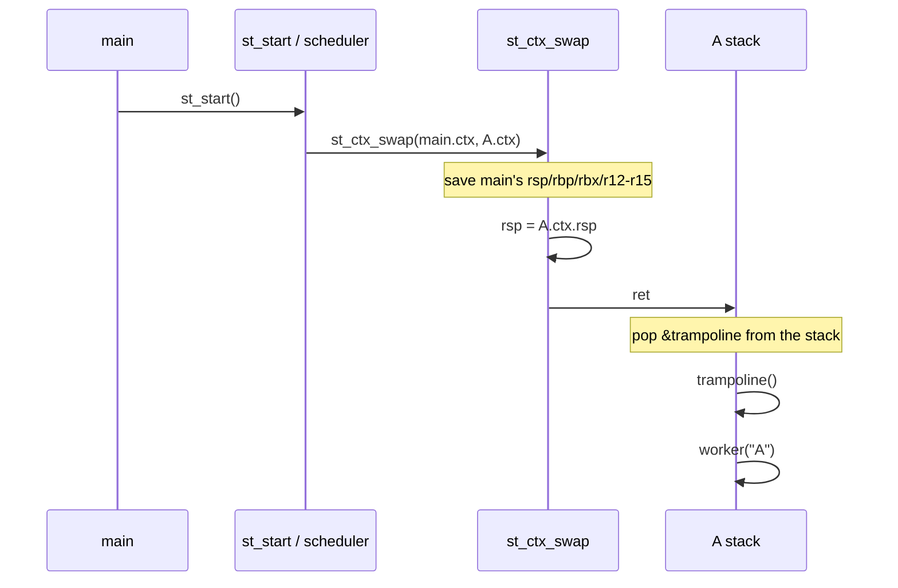
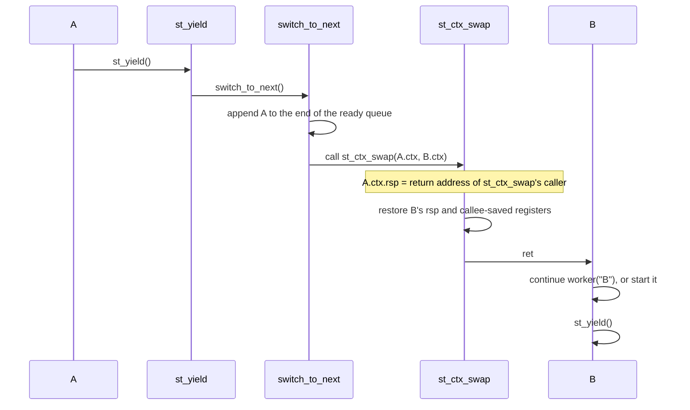

# trampoline

日本語版: [README.md](README.md)

A small cooperative-threading sample for x86_64. `trampoline` is a teaching example
for observing how control first enters a new thread by executing `ret` to an address
placed on its initial stack.

## Scope and limitations

The target is Linux x86_64 using the System V AMD64 ABI*1. This is a minimal,
single OS thread (one operating-system thread) teaching implementation; it does not cover interrupts, signal
handling, stack guard pages, or reclaiming a terminated thread's resources.

It also does not support CET*2 Shadow Stack. This sample switches the ordinary stack
and then executes `ret`, which does not match a Shadow Stack. The default teaching
`CFLAGS` disables it with `-fcf-protection=none`. Keep that option when overriding
`CFLAGS`.

* *1 **ABI** (Application Binary Interface): binary-level rules that let compiled
  code interoperate. Here they define argument registers, preserved registers, and
  stack alignment.
* *2 **CET** (Control-flow Enforcement Technology): an x86 CPU feature that detects
  control-flow tampering. Shadow Stack keeps return addresses separately from the
  ordinary stack.
## Prerequisites

The text assumes the following three points. Each is explained again where needed,
but look them up first if the terms are unfamiliar.

- An x86_64 `call` pushes a return address onto the stack, and `ret` pops it and
  jumps to it
- The stack grows from higher addresses toward lower addresses
- The System V AMD64 ABI*1 splits registers into callee-saved (`rbp`, `rbx`,
  `r12`-`r15`) and caller-saved (`rax`, `rcx`, `rdx`, `rsi`, `rdi`, `r8`-`r11`, etc.)

## Table of contents

1. [Prerequisites](#prerequisites)
2. [Behavior](#behavior)
3. [API](#api)
4. [Context switch](#context-switch)
5. [Build and run](#build-and-run)
6. [Observing with gdb (GNU Debugger)](#observing-with-gdb-gnu-debugger)

## Behavior

`main()` initializes the runtime, creates three threads (A, B, and C), and calls
`st_start()`. `st_start()` selects the first thread in the ready queue. Each thread
then repeats the following sequence:

```text
print -> sleep(1) -> st_yield() -> next thread
```

The threads never terminate. A, B, and C switch forever in FIFO order. There is no
path back to `main()` after the first call to `st_start()`.

`sleep(1)` is a blocking system call, so it blocks the OS thread (and therefore the
whole process). B and C cannot run while A is sleeping. Because cooperative threads
only switch at explicit yield points, this is an essential limitation of the model
and explains why one complete rotation takes three seconds.

## API

- `st_init()` — set the main thread as the currently running thread (current)
- `st_thread_create(fn, arg)` — create a TCB and private stack, then append it to the ready queue
- `st_start()` — perform the first switch to the head of the ready queue
- `st_yield()` — append the current thread to the end of the queue and switch to the next thread

This minimal API has no `st_thread_exit()`. If `fn` returns, the trampoline calls
`_exit(0)`, terminating the **entire process**, not merely that thread.

### TCB (Thread Control Block)

Each thread is represented by a `struct st_thread` ([`internal.h`](internal.h)),
called its TCB. No OS thread is ever created: a thread is just this structure plus
its private stack.

```c
struct st_thread {
    struct st_ctx ctx;          /* save/restore area for registers, rsp, and FP control state */
    void* stack;                /* private stack (64 KiB) */
    st_fn fn;                   /* thread entry function */
    void* arg;                  /* argument passed to fn */
    struct st_thread* next;     /* next link in the ready queue */
};
```

In the rest of this README, "A's context" means the `ctx` field of A's TCB.

## Context switch

[`ctx.S`](ctx.S) contains the actual `st_ctx_swap` implementation. It saves and
restores the x86_64 callee-saved registers, `rsp`, and floating-point (FP) control
state, then executes `ret`.

```text
save rsp/rbp/rbx/r12-r15 and FP control state into prev->ctx
restore the same state from next->ctx
replace rsp with next's stack pointer
ret to next's continuation address
```

### What the trampoline is

The trampoline is not the scheduler. It is a **small entry function that passes control
from the low-level context switch to an ordinary C function**. A new thread has not
been called by any function yet, so its stack has no normal return address. The first
context switch therefore uses this special path:

```text
1. st_thread_create() places the trampoline address on the initial stack
2. st_start() calls st_ctx_swap() (via switch_to_next()) to replace rsp with the new stack
3. ret in st_ctx_swap() jumps to the trampoline
4. the trampoline calls current->fn(current->arg) with a normal call
5. after fn yields, later switches follow the normal context-switch path
```

In other words, the trampoline is the adapter between the **artificial first `ret`
target** and the **ordinary call to `fn(arg)`**. It also provides one place to find the
function and its argument, and one place to handle the case where `fn` returns.

### 1. Initial stack for the trampoline

`st_thread_create()` does not ask the OS to create a thread. It allocates a TCB and a
64 KiB stack on the heap, then manually creates the following two words at the top of
the stack.

```c
sp = align_down(stack + 64 * 1024, 16);
*--sp = 0;                    // ABI padding; invalid return target if trampoline returns
*--sp = (uint64_t)trampoline; // destination of the first ret
thread->ctx.rsp = (uint64_t)sp;
```

The stack grows from higher addresses toward lower addresses, so its initial state is:

```text
high address
┌────────────────────────────┐  stack + 64 KiB, rounded down to a 16-byte boundary
│ 0                          │  ← ABI padding (not used normally)
├────────────────────────────┤
│ &trampoline                │  ← location referenced by thread->ctx.rsp
└────────────────────────────┘
low address
```

`ctx.rsp` points to `&trampoline`. There is no ordinary `call trampoline`. Instead,
`st_ctx_swap`, after restoring the next context, executes `ret` from that position;
`ret` pops `&trampoline` and jumps directly to the trampoline.

The `0` is not the trampoline's normal return destination. Immediately after `ret`
pops `&trampoline`, `rsp` points to this `0`. That makes `rsp % 16 == 8` at the
trampoline entry point, which satisfies the System V AMD64 ABI alignment rule.
The trampoline calls `_exit(0)` after `fn` returns, so normal execution never uses the
`0`. If the trampoline returned by mistake, its `ret` would try to jump to address 0
and terminate abnormally.

### 2. The first context switch

When `main()` calls `st_start()`, the `switch_to_next()` inside it selects the head
of the ready queue (A), saves the main context, and restores A's context.



This first `ret` is not returning from an ordinary function. It uses the
pre-installed `&trampoline` on A's stack as the return address. That is the key idea
behind the trampoline.

The trampoline takes no arguments. `st_ctx_swap` enters it with `ret`, not `call`, so
it does not prepare argument registers. This implementation does not store `fn` or
`arg` in `rdi` or any other caller-saved register; consequently, the trampoline cannot
recover its TCB from function arguments. Instead, the scheduler sets the global
`current` to the next thread immediately before the switch, and the trampoline finds
itself through `current->fn(current->arg)`. Another implementation could initialize
`rdi` in the initial context and pass the TCB as an argument.

### 3. Return addresses during yield

When A's worker calls `st_yield()`, control normally proceeds through the C call chain
`st_yield()` → `switch_to_next()` → `st_ctx_swap()`. Every CPU `call` pushes a return
address onto the stack, so A's stack contains return addresses for these calls.

The following is a **schematic view showing only return addresses**. The real stack also
contains each function's saved `rbp`, local variables, and alignment space.

```text
 A's stack (return addresses during yield only)
 high address
 ┌──────────────────────────────────────────
 │ return to worker (call to st_yield)
 ├──────────────────────────────────────────
 │ return to st_yield (call to switch_to_next)
 ├──────────────────────────────────────────
 │ return to switch_to_next (call to st_ctx_swap)       ← current rsp
 └──────────────────────────────────────────
 low address
```

The first instruction of `st_ctx_swap` saves this `rsp` into A's `ctx.rsp`. It then
restores B's `ctx.rsp` and executes `ret`, so B resumes at the return address saved on
B's stack.



After B and C yield and A is selected again, A's `rsp` and saved registers are
restored. `ret` returns to the address immediately after A's earlier call to
`st_ctx_swap`; from there, the remaining `switch_to_next()` and `st_yield()` calls
return normally, and the worker continues with its next instruction. The resume path
just follows ordinary function returns; there is no additional mechanism.

The diagram above represents a logical call chain. The number of physical stack frames
and return addresses depends on the compiler, compiler version, and optimization flags.
For example, with `-O2`, `ready_push()` and `ready_pop()` may be inlined, and part or
all of `st_yield()` / `switch_to_next()` may be transformed into tail calls (`jmp`).
In that case, the stack may retain only the return address from worker's call to
`st_yield()`, and `st_ctx_swap` may return directly to worker. This physical stack
differs from the diagram, but the program still works correctly.

The reason is that, even after optimization, `st_ctx_swap` is treated as a function
boundary following the System V AMD64 ABI. At the switch point, the saved `rsp` points
to a valid continuation address. When the thread resumes, that `rsp` and the
callee-saved registers are restored, and `ret` transfers control to the continuation.
Caller-saved registers are not expected to retain their values across an ordinary
function call. Thus, inlining and tail calls may change the frame structure while the
context switch remains correct as long as `st_ctx_swap` preserves this ABI contract.

This does not mean that every optimization is unconditionally safe. The switch
function must be called as a normal function boundary, the continuation must be valid,
and the ABI-required state must be restored. This sample handles the x86_64 System V
integer registers, x87 control word, and MXCSR*3. It does not handle the x87 register
stack, AVX (Advanced Vector Extensions) extended state, signal context, or CET Shadow Stack.

* *3 **MXCSR**: the floating-point control/status register of x86 Streaming SIMD
  Extensions (SSE). This sample keeps its control state, including rounding mode,
  per thread.

The educational build in the `Makefile` uses `-O0`, keeps the frame pointer, and
disables sibling-call optimization so that the **return-address chain** shown in the
diagram is easier to observe in the binary. The complete physical layout still
contains saved `rbp`, locals, and padding, so it is not identical to the schematic.
These flags are also the basis for following the stack in gdb.

### 4. Saved registers

`st_ctx_swap` saves `rsp`, `rbp`, `rbx`, and `r12` through `r15`, plus the x87 control
word and MXCSR*3.
Under the System V AMD64 ABI, `rbp`, `rbx`, and `r12`-`r15` are the callee-saved
registers; `rsp` is not classified as callee-saved, but it is logically restored
across a function call, so it is saved as well. Because `st_ctx_swap` is reached
through an ordinary function-call boundary, caller-saved registers are the caller's
responsibility, and this small switch routine does not save them. Conversely, it saves
and restores each thread's x87 control word and MXCSR so, for example, a rounding-mode
change in one thread does not leak into another.

```text
save into prev->ctx:  rsp, rbp, rbx, r12, r13, r14, r15, mxcsr, x87 control word
restore from next->ctx: the same state
finally: ret with rsp pointing at the next stack
```

The sample does not use the kernel scheduler, timer interrupts, `setcontext()`, or
`makecontext()`. It manually switches user-space stacks and registers on a single OS
thread.

### Optional exercise: verify that rounding modes do not leak

Saving MXCSR and the x87 control word keeps each logical thread's floating-point
rounding mode independent. To observe this, replace the A and B workers in `main.c`
with the following worker, which yields once. Also include `<fenv.h>` and `<stdint.h>`.
Link the exercise version with `make LDLIBS=-lm build`, because it uses `fesetround()`
and `fegetround()`.

```c
static void* rounding_worker(void* arg) {
    int mode = (int)(intptr_t)arg;
    char line[64];

    fesetround(mode);
    st_yield();
    snprintf(line, sizeof(line), "%s\n",
             fegetround() == mode ? "rounding mode preserved" : "rounding mode leaked");
    write_all(line);
    return NULL;
}

/* Create only A and B. Once A resumes and prints, its return exits the process. */
st_thread_create(rounding_worker, (void*)(intptr_t)FE_DOWNWARD);
st_thread_create(rounding_worker, (void*)(intptr_t)FE_UPWARD);
```

With the current `ctx.S`, A prints `rounding mode preserved`. In a teaching-only
variant that removes `stmxcsr` / `ldmxcsr` and `fnstcw` / `fldcw`, B's last setting
remains active when A resumes, and A prints `rounding mode leaked`. Checking the
control state directly avoids relying on rounding-sensitive arithmetic that an
optimizer might transform.

## Build and run

```sh
make build
make run
```

The educational build uses `-O0`, keeps the frame pointer, and disables sibling-call
optimization to make the call chain and stack easier to observe. With optimization
enabled, inlining and tail calls can make the physical frame layout differ from the
return-address diagram.

`make run` runs forever. Press `Ctrl-C` to stop it. A, B, and C switch in FIFO order at
one-second intervals (the three serialized `sleep(1)` calls make one full rotation take
three seconds).

```text
[A] step 0
[B] step 0
[C] step 0
[A] step 1
[B] step 1
[C] step 1
...
```

Each worker formats its line with `snprintf` and writes it through
`write_all()` ([`safe_helpers.h`](safe_helpers.h)), which calls `write(2)` directly
and retries partial writes and `EINTR`. Any other error, or a zero-byte write (no
progress), stops output for this demo. stdio buffering carries process-wide state, so to avoid mechanisms
unrelated to manual stack switching, this sample writes output immediately
without buffering.

The execution route is selected automatically for the host environment:

- x86_64 Linux: native compiler / native execution
- ARM Linux: `x86_64-linux-gnu-gcc` and `qemu-x86_64-static`
- macOS: the amd64 Linux VM `x64-linux-env` in OrbStack

To create the OrbStack VM on macOS:

```sh
make linux-machines
make run
```

`ctx.S` uses GNU assembler Intel syntax. On macOS, build through the x86_64 Linux route
instead of assembling it directly on the host.

## Observing with gdb (GNU Debugger)

The `-O0` + `-fno-omit-frame-pointer` + `-fno-optimize-sibling-calls` flags exist for
this observation. This sample is an x86_64 Linux binary, so run gdb inside an x86_64
Linux environment. On macOS, use the OrbStack VM. If gdb is not installed in the VM,
first run `scripts/in-linux.sh x64-linux-env "apt-get update && apt-get install -y gdb"`.

```sh
make build
scripts/in-linux.sh x64-linux-env "gdb -q ./trampoline_sample"
```

### First arrival at the trampoline

```text
(gdb) break trampoline
(gdb) run
(gdb) p/x $rsp
(gdb) x/gx $rsp
(gdb) bt
```

Execution stops right after `ret` has popped `&trampoline`, and you can confirm:

- `p/x $rsp` ends in `...8` — the ABI entry alignment for a function
  (`rsp % 16 == 8`)
- `x/gx $rsp` shows `0x0` — the alignment word placed on the initial stack.
  `&trampoline` was 8 bytes below current `rsp` (already consumed by `ret`)
- `bt` does not show a normal caller chain. Depending on the GDB version, it may show
  only the trampoline or stop partway through the backtrace, because no function ever
  `call`ed the trampoline

If `break trampoline` does not resolve the symbol, use `break st.c:trampoline`.

### Return addresses during yield

```text
(gdb) break st_ctx_swap
(gdb) run
(gdb) continue
(gdb) bt
(gdb) x/gx $rsp
(gdb) info symbol *(void**)$rsp
```

The first stop from `run` is the initial switch from main to A, so it belongs to the
`st_start()` call chain. Continue once to stop at A's yield to B; there,
`st_ctx_swap` is at the end of an ordinary call chain.

- `bt` shows the chain `st_ctx_swap` <- `switch_to_next` <- `st_yield` <- `worker`,
  matching the diagram in "3. Return addresses during yield"
- `x/gx $rsp` is the return address to `st_ctx_swap`'s caller; `info symbol`
  confirms it lies inside `switch_to_next`

Stop the program with `Ctrl-C` and leave gdb with `quit`.
